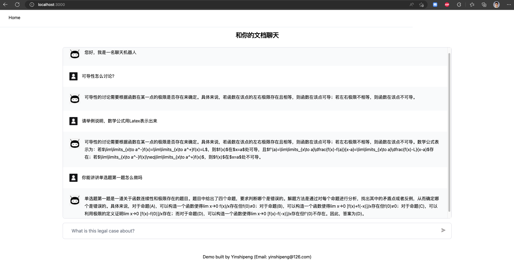
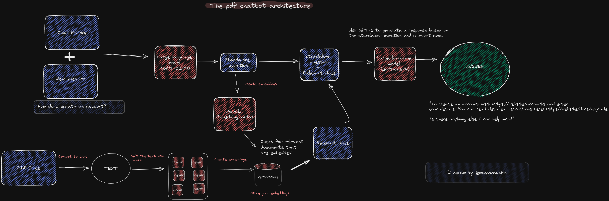

# 为你的 PDF 文件创建一个聊天机器人

使用新的 GPT 的 API 为多个大型 PDF 文件构建 ChatGPT 聊天机器人。

使用的技术栈包括 LangChain、Hnswlib、Typescript、OpenAI 和 Next.js。LangChain 是一个框架，可以更容易地构建可扩展的 AI/LLM 应用程序和聊天机器人。Hnswlib 是一个向量数据库，用于存储嵌入和文本格式的 PDF，以便以后检索类似的文档。



具体技术原理如下图：



前提：请确保你使用的 Node 版本是 18.16.0 或更高版本

## 准备

1. 克隆仓库或下载压缩包

```
git clone https://github.com/yinshipeng/langchain-chatbox-pdf.git
```

2. 安装依赖

首先运行' npm install pnpm -g '来全局安装 pnpm。

然后执行:

```
pnpm install
```

安装完成后，你现在应该看到一个“node_modules”文件夹。

3. 设置你的 `.env` 文件

- 复制 `.env.example` 到 `.env`

```
cp -r .env.example .env
```

- 你的 `.env` 文件 应该是这样:

```
OPENAI_API_KEY=
```

4. 在 `utils/makechain.ts` 文件中根据您自己的需要设置提示词 `QA_PROMPT`。 修改模型名称 `modelName`，我自己用的是`gpt-3.5-turbo`。

## 转换

**这个仓库可以加载多个 PDF 文件**

1. 在“docs”文件夹中，添加 pdf 文件或包含 pdf 文件的文件夹。

2. 运行脚本 `pnpm run ingest` 可以将 pdf 文档进行分词并转换为向量文档存入向量数据库。**数据是存在.cache 文件夹**，如果你需要重新向量化文档可以直接删除此文件夹。

## 运行

一旦您确认嵌入和内容已经成功添加到 Hnswlib 数据库中，您就可以运行应用程序“pnpm run dev”来启动本地开发环境，然后在聊天界面中键入一个问题。在浏览器输入 http://localhost:3000 就可以打开页面。

## 代理

由于需要访问 openai 的 api，存在科学上网的问题。所以你机器上需要安装 ClashX 工具，它的代理端口是 7890，其他工具没有试过。

浏览器代理和 Shell 客户端代理是两回事，所以你需要执行以下代码确保你的 Shell 可以走代理

```
export HTTP_PROXY=http://127.0.0.1:7890
export HTTPS_PROXY=http://127.0.0.1:7890
```

## 控制

1. 在 utils/makechain.js 文件中，修改 temperature 字段的值可以控制 GPT 模型自我发挥的程度，1 是让 GPT 自由发挥、畅所欲言， 0 是让 GPT 不要添加任何自己的内容。
2. 在 utils/makechain.js 文件中，修改 returnSourceDocuments 字段可以控制是否输入引用文档的内容，true 是输出，false 是不输出
3. 在 utils/makechain.js 文件中，修改 asRetriever 函数中的参数可以控制在向量数据库中查询几个相似的数据交由 GPT 参考。

## 注意

1. 一次性向量化多个文档，可能会存在回答的内容发生串联的现象，这个自己可以尝试一下。
2. 不要向量化大文档，OPENAI 向量文档是需要消耗 token。

## 交流


